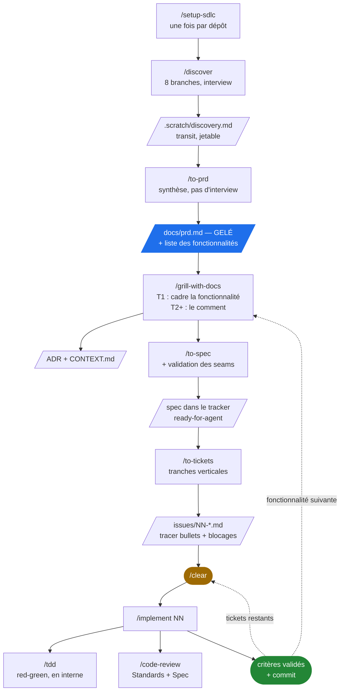
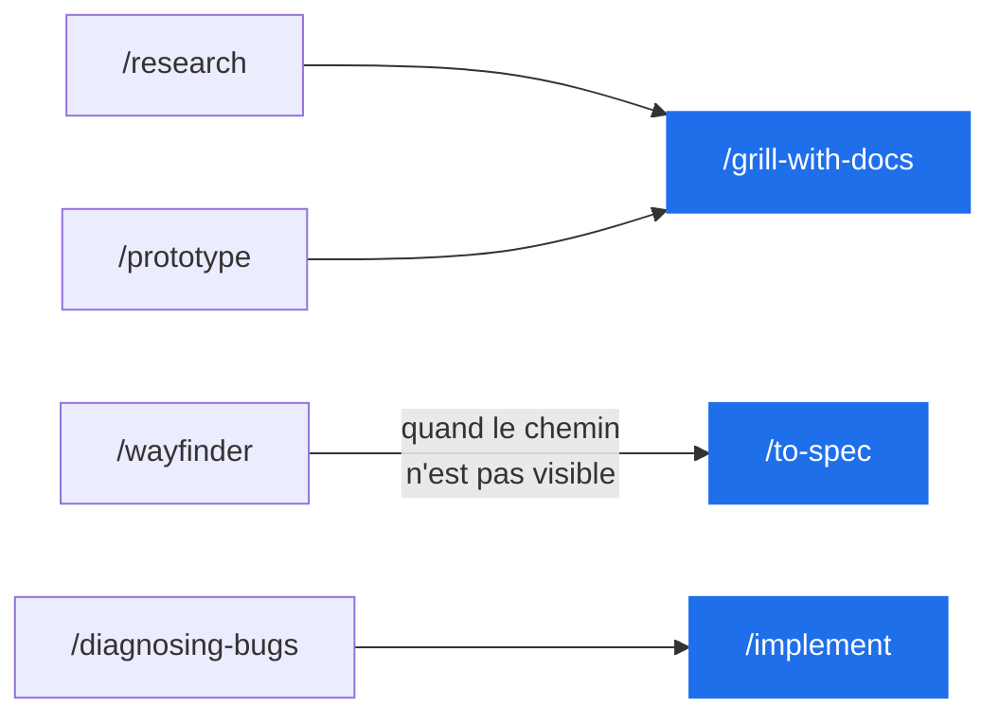

# Le flux

Comment les skills de ce dépôt s'enchaînent, du dépôt vide au premier ticket commité.

## La chaîne principale



**Chaque skill lit ses entrées sur disque**, donc chacun tourne dans une fenêtre neuve. Enchaîner `/discover` à `/to-tickets` d'une traite reste **recommandé** — le cadrage, la conception et le découpage raisonnent mieux sur une même réflexion continue — mais ce n'est plus une condition de survie des données. Après `/to-tickets`, `/clear` entre chaque `/implement` : chaque ticket est autoportant.

## Les artefacts

| Fichier | Écrit par | Lu par | Durée de vie |
|---|---|---|---|
| `docs/agents/*.md` | `/setup-sdlc` | tous | permanent |
| `.scratch/discovery.md` | `/discover` | `/to-prd` | jetable |
| **`docs/prd.md`** | `/to-prd` | `/grill-with-docs` | **survit au projet, gelé** |
| `CONTEXT.md`, `docs/adr/` | `/grill-with-docs` | tous | permanent |
| `.scratch/<feature-slug>/decisions.md` | `/grill-with-docs` | `/to-spec` | jetable |
| `.scratch/<feature-slug>/spec.md` (ou une issue du tracker) | `/to-spec` | `/to-tickets`, `/code-review` | le temps de la fonctionnalité |
| `issues/NN-*.md` | `/to-tickets` | `/implement` | le temps de la fonctionnalité |

## Les quatre niveaux

```
PRD  ──▶  fonctionnalité  ──▶  spec  ──▶  ticket  ──▶  code
```

Une **fonctionnalité** n'est pas un document : c'est une ligne du PRD, la partition du périmètre en morceaux de la taille d'une spec. Équivalent d'un *epic*.

Le **lot** groupe ces lignes dans le PRD — le lot 1 est le MVP, *la plus petite combinaison qui fait bouger une métrique*, et c'est la seule partie de `## Fonctionnalités` que le gel couvre. Ce n'est pas un cinquième niveau : c'est un regroupement, il ne produit aucun artefact.

Ces niveaux n'existent pas pour coordonner des humains — ils compressent du contexte. D'où le test qui décide s'il faut en sauter un :

> **Un niveau se justifie s'il fait tenir le suivant dans une fenêtre. Sinon c'est de la cérémonie.**

**Sauter `/to-spec` a un coût précis.** C'est le seul skill qui esquisse les **seams** de test et te les fait valider (`to-spec` étape 2) ; `/to-tickets` ne prononce jamais le mot. Or `/implement` étape 2 exige de travailler « aux seams convenus à l'avance » et pose qu'« un seam non confirmé n'est pas un seam ». Si tu sautes la spec, tu dois faire proposer les seams par `/implement` au démarrage et les ratifier — sinon sa précondition n'est satisfaite par personne. Le saut ne se justifie que sur une fonctionnalité déjà entièrement discutée dans la fenêtre courante, aux seams évidents.

## Hors chaîne



| Skill | Quand |
|---|---|
| `/research` | déléguer de la lecture à un agent de fond, sur sources primaires |
| `/prototype` | une question de conception qui ne se tranche pas sur le papier |
| `/wayfinder` | un chantier trop gros pour une session — produit des décisions, pas du code |
| `/diagnosing-bugs` | un bug dur, une régression, un test intermittent |
| `/resolving-merge-conflicts` | un conflit de merge ou de rebase déjà en cours |
| `/wait-what` | un message qui n'est pas passé — re-pitch |
| `/handoff` | nouveau harness, nouveau répertoire, collègue, ou fork d'une tâche annexe |
| `/grill-me` | l'interview, hors d'un répertoire de travail |
| `/domain-modeling`, `/codebase-design` | le vocabulaire sous les autres skills — quand ce sont les mots qui coincent |
| `/teach`, `/writing-for-agents`, `/which-skill` | méta, hors cycle |

## Ce qui reste à recâbler

La couche produit (`skills/product/`) a été greffée au-dessus d'une chaîne, héritée du dépôt d'origine, qui n'en avait pas. Un joint reste ouvert :

- **`/which-skill` est périmé.** Il ignore `/discover` et `/to-prd`, et route vers quatre commandes non livrées (`/triage`, `/improve-codebase-architecture`, `/to-questionnaire`, `/wizard`). C'est le routeur : quelqu'un qui le suit aujourd'hui se fait mal orienter.

Et une limite à connaître : l'indépendance des fenêtres repose sur le fait que `/grill-with-docs` **écrive effectivement** `decisions.md`. C'est une obligation inscrite dans un skill, pas un mécanisme — elle échoue en silence si l'agent la saute. Son absence est au moins observable, ce que l'ancienne règle « une seule fenêtre » n'était pas.
