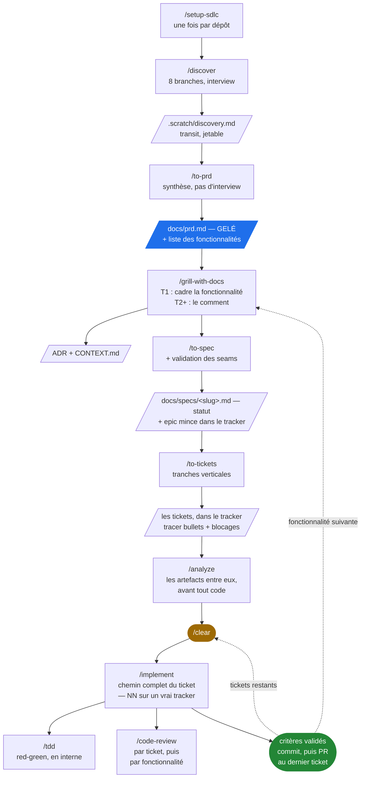
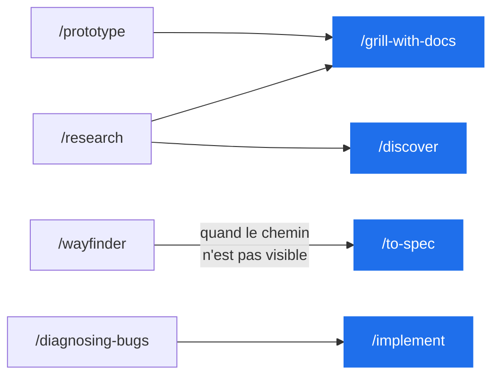

# Le flux

Comment les skills de ce dépôt s'enchaînent, du dépôt vide au premier ticket commité.

## La chaîne principale



Une fonctionnalité tient sur une branche, un ticket sur un commit : `/implement` crée `feature/<feature-slug>` au premier ticket, y commite les suivants, et ouvre la PR au dernier. Il s'arrête à la PR : merger appartient à l'utilisateur, et l'agent ne le fait que si celui-ci le lui demande — `/setup-sdlc` écrit cette règle dans `docs/agents/git-workflow.md`, qui dit aussi pourquoi.

D'où **deux revues à deux découpages différents**. À chaque ticket, `/code-review` relit le ticket contre son ticket. Au dernier, il relit la fonctionnalité entière contre le trunk et contre la **spec** — la seule passe capable de voir une exigence tombée entre deux tickets, ou une duplication née entre le ticket 1 et le ticket 4. Ni l'une ni l'autre ne peut faire le travail de l'autre.

`/analyze` est la porte entre le découpage et l'exécution, et le seul contrôle **avant** qu'une ligne existe : il confronte les artefacts les uns aux autres — une exigence chiffrée du PRD que la spec a perdue, une décision de spec qu'aucun ticket ne porte, un slug divergent, un ticket sans critère d'acceptation. Ce que `/code-review` cherche plus tard demande un diff ; ce que `/analyze` cherche est déjà visible et coûte, corrigé ici, un `/to-tickets` relancé plutôt qu'une fonctionnalité refaite. Il ne modifie rien : il rapporte, et l'utilisateur décide.

**Chaque skill lit ses entrées sur disque**, donc chacun tourne dans une fenêtre neuve. Enchaîner `/discover` à `/to-tickets` d'une traite reste **recommandé** — le cadrage, la conception et le découpage raisonnent mieux sur une même réflexion continue — mais ce n'est plus une condition de survie des données. Après `/to-tickets` vient `/analyze`, qui a besoin des artefacts et non de la conversation ; le `/clear` tombe juste après lui, puis entre chaque `/implement` : chaque ticket est autoportant. `/analyze` ne tourne qu'une fois par fonctionnalité, pas à chaque ticket.

## Les artefacts

| Fichier | Écrit par | Lu par | Durée de vie |
|---|---|---|---|
| `docs/agents/*.md` | `/setup-sdlc` | tous | permanent |
| `.claude/settings.json`, `.claude/hooks/` | `/setup-sdlc` | le harness | permanent |
| `docs/research/<sujet-slug>.md` | `/research` | `/discover`, `/grill-with-docs` | courte — une note dit ce qui était vrai le jour où elle a été écrite |
| `.scratch/discovery.md` | `/discover` | `/to-prd` | jetable |
| **`docs/prd.md`** | `/to-prd` | `/grill-with-docs`, `/to-spec` | **survit au projet, gelé** |
| `CONTEXT.md`, `docs/adr/` | `/grill-with-docs` | tous | permanent |
| `.scratch/<feature-slug>/decisions.md` | `/grill-with-docs`, avec ou sans PRD | `/to-spec` | jetable |
| `.scratch/<chantier>/map.md` (ou l'issue `wayfinder:map`) | `/wayfinder` | `/wayfinder`, `/to-spec` | le temps du chantier |
| `.scratch/<chantier>/decisions/<NN>-<slug>.md` (ou une issue enfant de la carte) | `/wayfinder` | `/wayfinder`, `/to-spec` | le temps du chantier |
| **`docs/specs/<feature-slug>.md`** | `/to-spec` | `/to-tickets`, `/code-review` | **durable, avec un statut** — `Draft` → `Approved` → `Implemented` → `Superseded by …` |
| l'epic `spec: <feature-slug>` dans le tracker | `/to-spec` | l'humain, pour l'avancement | le temps de la fonctionnalité — un vrai tracker seulement |
| `.scratch/<feature-slug>/issues/<NN>-<slug>.md` | `/to-tickets` | `/implement` | le temps de la fonctionnalité |

## Les quatre niveaux

```
PRD  ──▶  fonctionnalité  ──▶  spec  ──▶  ticket  ──▶  code
```

Une **fonctionnalité** n'est pas un document : c'est une ligne du PRD, la partition du périmètre en morceaux de la taille d'une spec. Sur un vrai tracker elle prend corps dans une **epic** — l'issue qui suit son avancement — mais l'epic n'est pas un cinquième niveau : elle ne porte aucun contenu propre, seulement un lien vers la spec et la liste des tickets.

Le **lot** groupe ces lignes dans le PRD — le lot 1 est le MVP, *la plus petite combinaison qui fait bouger une métrique*, et c'est la seule partie de `## Fonctionnalités` que le gel couvre. Ce n'est pas un cinquième niveau : c'est un regroupement, il ne produit aucun artefact.

Ces niveaux n'existent pas pour coordonner des humains — ils compressent du contexte. D'où le test qui décide s'il faut en sauter un :

> **Un niveau se justifie s'il fait tenir le suivant dans une fenêtre. Sinon c'est de la cérémonie.**

**Sauter `/to-spec` a un coût précis.** C'est le seul skill qui esquisse les **seams** de test et te les fait valider (`to-spec` étape 3) ; `/to-tickets` ne prononce jamais le mot. Or `/implement` étape 3 exige de travailler « aux seams convenus à l'avance » et pose qu'« un seam non confirmé n'est pas un seam ». Si tu sautes la spec, tu dois faire proposer les seams par `/implement` au démarrage et les ratifier — sinon sa précondition n'est satisfaite par personne. Le saut ne se justifie que sur une fonctionnalité déjà entièrement discutée dans la fenêtre courante, aux seams évidents.

Le saut coûte une seconde chose depuis que la PR existe : sans spec, la revue de fonctionnalité de `/implement` étape 7 n'a rien à confronter au diff complet. Son axe Spec est alors sauté, et il ne reste que des revues de tickets contre des tickets — donc plus personne pour voir une exigence tombée au découpage.

## Hors chaîne



| Skill | Quand |
|---|---|
| `/research` | déléguer de la lecture à un agent de fond, sur sources primaires |
| `/prototype` | une question de conception qui ne se tranche pas sur le papier |
| `/wayfinder` | un chantier trop gros pour une session — produit des décisions, pas du code |
| `/diagnosing-bugs` | un bug dur, une régression, un test intermittent |
| `/resolving-merge-conflicts` | un conflit de merge ou de rebase déjà en cours |
| `/improve-codebase-architecture` | l'architecture freine — chercher les modules *shallow* avant qu'une fonctionnalité ne s'y casse les dents |
| `/wizard` | une procédure manuelle que l'agent ne peut pas faire à ta place, et qu'il faut ré-expliquer chaque fois |
| `/to-questionnaire` | une décision qui dépend de quelqu'un d'autre |
| `/wait-what` | un message qui n'est pas passé — re-pitch |
| `/handoff` | nouveau harness, nouveau répertoire, collègue, ou fork d'une tâche annexe |
| `/grill-me` | l'interview, hors d'un répertoire de travail |
| `/domain-modeling`, `/codebase-design` | le vocabulaire sous les autres skills — quand ce sont les mots qui coincent |
| `/teach`, `/writing-for-agents`, `/which-skill` | méta, hors cycle |
| `/retro` | après coup — une session qui a mal tourné, et ce que l'environnement doit en apprendre |

## Ce qui reste à recâbler

La couche produit (`skills/product/`) a été greffée au-dessus d'une chaîne, héritée du dépôt d'origine, qui n'en avait pas. Un joint reste ouvert :

- **La branche montante du V n'a pas de skill.** Les métriques de succès du PRD sont ce qui rend l'itération falsifiable, et rien ne les rouvre une fois le lot 1 livré. `/to-prd` pose cette relecture comme un rendez-vous que l'utilisateur prend lui-même, et c'est délibéré : aucune commande ne la déclenche, la chaîne ne la rappellera pas. C'est la seule branche de validation qu'aucun test automatique ne couvre.

Et une limite à connaître : l'indépendance des fenêtres repose sur le fait que `/grill-with-docs` **écrive effectivement** `decisions.md`. C'est une obligation inscrite dans un skill, pas un mécanisme — elle échoue en silence si l'agent la saute. Son absence est au moins observable, ce que l'ancienne règle « une seule fenêtre » n'était pas.
